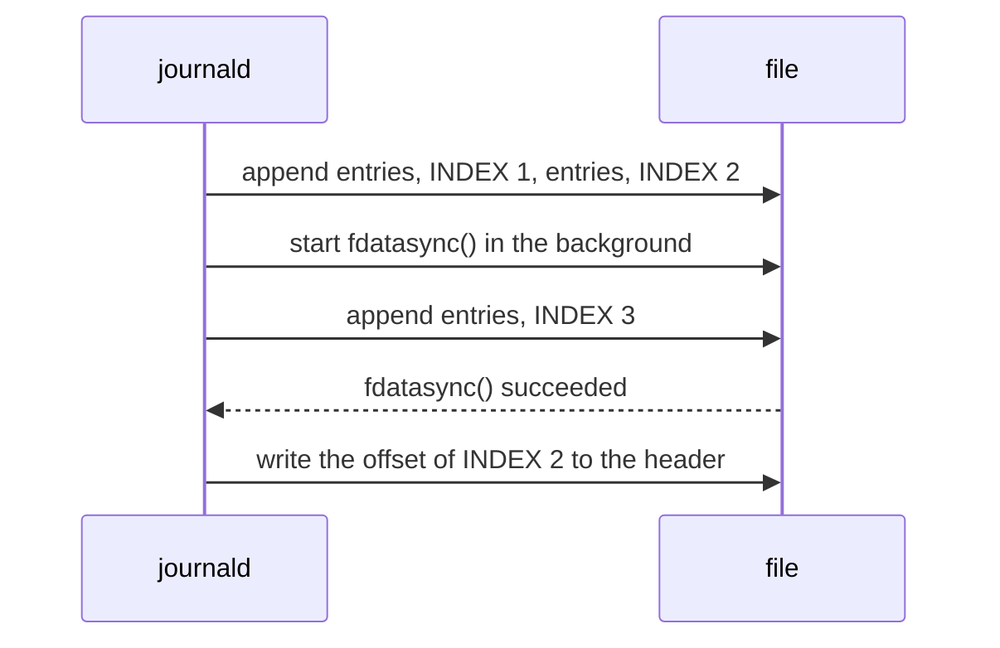
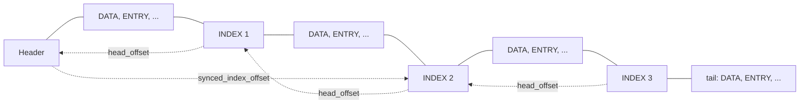
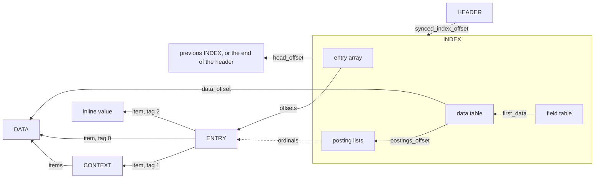
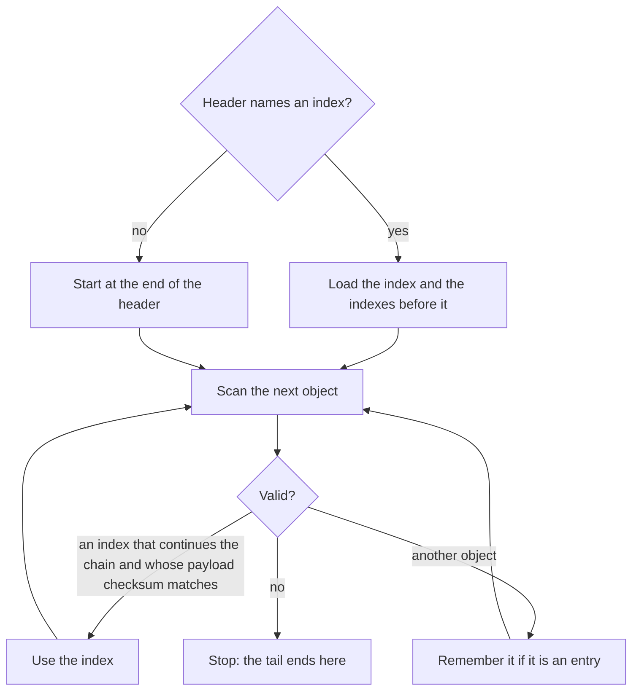
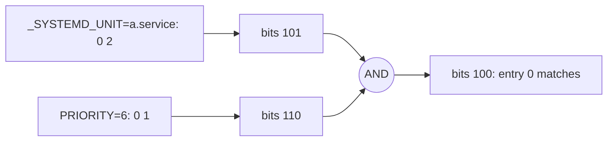
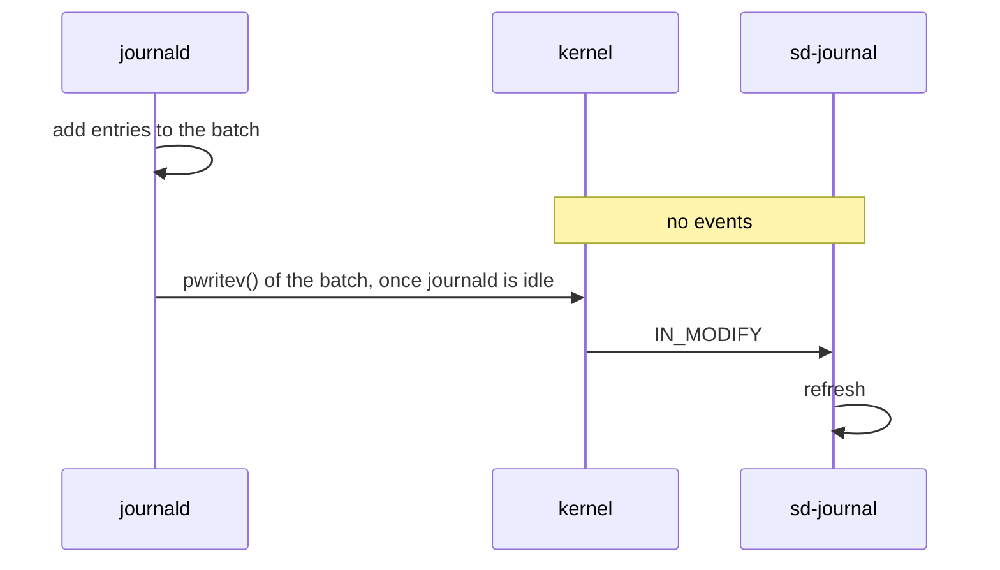
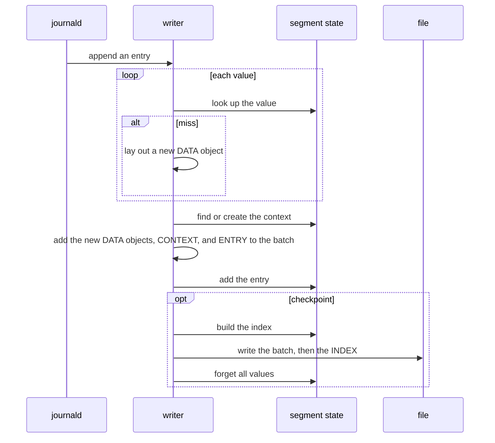
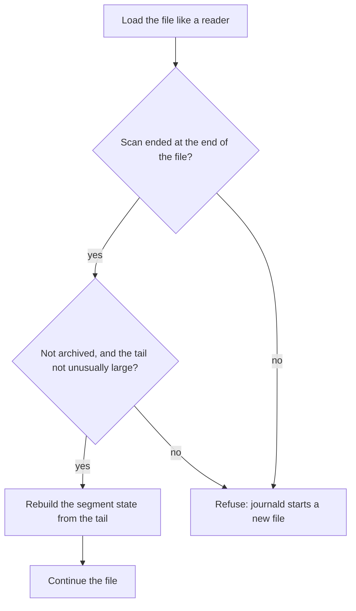
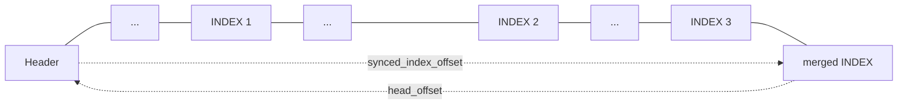

# Segmented Journal File Format

The segmented variant of the journal file format builds on [Journal File Format](JOURNAL_FILE_FORMAT). Read that first.

New files use this format, unless `SYSTEMD_JOURNAL_SEGMENTED=0` is set.
Files in this format have the `HEADER_INCOMPATIBLE_SEGMENTED` header flag, so older versions of systemd refuse to open them.

## The Problem

A classic journal file is a set of linked structures that are updated in place.
Appending one entry changes the header, hash table buckets and chains, the entry array of the file, and the entry array of each value of the entry.
These locations are spread all over the file, so each writeback of dirty pages consists of many small, scattered writes,
and writes several times more bytes than the payload it stores (see "Measurements").

## The Idea

Objects are never changed once they are written. The file is a log: appending an entry writes new objects at the end, and nothing else.

The structures that the classic format updates in place exist to find entries. The segmented format replaces them with *indexes*.
The writer builds an index in memory and appends it in one piece every 4 MiB, or every sixteenth of the maximum file size if that is smaller.
Readers use the indexes for most of the file, and read the few objects after the newest index directly.
When a file is archived, its indexes are merged into one.

```
Header | DATA ENTRY DATA ENTRY ... | INDEX DATA CONTEXT ENTRY ... | INDEX DATA ENTRY ... ENTRY ...
         \_______ segment 1 _______/ \_________ segment 2 ________/ \_______ tail (segment 3) ______/
```

## Objects

Field objects, hash tables, and entry arrays are gone.
`DATA` objects hold one `FIELD=value` payload and its hash, without links to other objects or counters.
`ENTRY` objects hold the sequence number, timestamps, and boot ID of an entry, and refer to its data.
`TAG` objects are used for sealing, as before. `CONTEXT` and `INDEX` objects are new, and explained below.

* An object is written once, at the end of the file, and never changed. It only refers to objects at lower offsets.
* Each object has a checksum, keyed with the file ID and covering its offset.
  A reader that scans the log accepts an object only if it lies completely within the file size and its checksum matches.
  Hence a live reader never sees a partial object, without any locking.
  After a crash, an object that was cut short is recognized, except for the payload of a data object, which the checksum does not cover.
  Objects that an index or another object refers to are not checked again.
* The header is written when the file is created, and changes only when the file is synced or archived. Its counters stay 0, except `n_entries` and `tail_entry_seqnum`, see the on-disk reference. Readers learn the counters from the log.

## Segments and Indexes

A *segment* is the part of the log that one index covers. The *tail* is the segment that is still being filled.
Within a segment, the writer stores each distinct value once. It keeps the *segment state* in memory: for each value its data object, and the entries that have it.

A *checkpoint* ends the segment: the writer turns the segment state into an index, appends it, and starts a new segment with an empty state.
A value that occurs again after a checkpoint is hence stored again.
Checkpoints happen when the tail reaches 4 MiB or a sixteenth of the maximum file size, whichever is smaller, and when the file is archived.
This bounds the memory of the writer and the part of the file that readers have to scan.

An index answers the questions that the classic format answers with its hash tables and entry arrays, for the entries of one segment:

* Which entries are in the segment? The *entry array* lists their offsets, in order.
* Which fields occur? The *field table* lists their names.
* Which entries have `FIELD=value`? The *data table* has one item per distinct value:
  the offset of a data object with that value, and a *posting list* of the entries that have it.

For example, this segment and its index:

```
entry 0: _SYSTEMD_UNIT=a.service PRIORITY=6    entry array: offsets of entry 0, 1, and 2
entry 1: _SYSTEMD_UNIT=b.service PRIORITY=6    field table: PRIORITY, _SYSTEMD_UNIT
entry 2: _SYSTEMD_UNIT=a.service PRIORITY=3    data table:  PRIORITY=3 -> 2, PRIORITY=6 -> 0 1,
                                                            _SYSTEMD_UNIT=a.service -> 0 2, _SYSTEMD_UNIT=b.service -> 1
```

Fields and values are sorted by hash, so lookups are binary searches.
A posting list with a single entry is stored in the item itself. Longer ones are run-length encoded, or a bitmap if that is smaller.

An index also records the state of the file at its position, such as the number of entries and the timestamps of the last entry.
These are the header fields that the classic format updates in place.
Each index records where its segment starts, which is the offset of the previous index, so the indexes form a chain.

Why one index per segment, and not one per file? An index of entries that are already written never has to change, and writing it is one sequential write.
The price is that a query on an active file looks each value up in each index. Archived files make up most of the journal, and have one index.

## Contexts

Most fields of an entry are trusted metadata that journald adds, such as `_PID=`, `_UID=`, and `_SYSTEMD_UNIT=`.
They are the same for all entries of a process.
A `CONTEXT` object stores such a set of data objects once. An entry refers to it with one item, instead of one item per field.
The writer writes a context the second time it sees a set in a segment.
Contexts only make entries smaller. The index still lists each value with all entries that have it.

## The Synced Index

An index may be in the page cache but not on disk yet, and after a crash a reader must not use an index that was written in part.
Checking the payload checksum of every index would mean reading all indexes whenever a file is opened.

journald syncs files periodically with `fdatasync()`. After a successful sync, it writes the offset of the newest index that existed when the sync started to the header, in `synced_index_offset`.
Readers load that index and the indexes before it without checking their payload.
An index after it is only used if its payload checksum matches.



INDEX 3 may not be on disk yet, so the header names INDEX 2. The file then looks like this:



When a file is archived, the header state becomes `STATE_ARCHIVED`. It tells readers that the file does not change anymore.

## References Between Objects

Each arrow points to a lower offset, except for the one from the header and for inline values, which are part of the entry (see "Storage Classes").
`DATA` and `TAG` objects refer to nothing.



## Reading

### Opening a File

1. Load the index that the header names, and the indexes before it.
2. Scan the log after that index, and check each object. The entries found are the tail. An index that continues the chain is used too, if its payload checksum matches.
3. Stop at the first object that is not valid, other than an index, which is skipped: in an active file, usually the end of the file, or an object that is still being written.

Opening hence reads what was written since the last successful sync, plus at most one segment.
A file whose header names no index is scanned from the beginning.



Indexes are derived data, but a reader trusts the ones it uses. If it finds that one is inconsistent, it fails with `-EBADMSG`, as for a damaged entry array of a classic file.

### Finding Entries

The indexes and the tail together form an array of all entries, ordered by offset.
Seeking to a sequence number or timestamp is a binary search over that array, like in the classic format.

### Matches

`sd-journal` evaluates the whole match expression of a file into a bitmap with one bit per entry.
For each index it looks up each value of the expression and decodes the posting lists. `AND` and `OR` become bitwise operations.
The entries of the tail are read and checked against the expression.
Moving to the next matching entry is a search for the next set bit.

For the segment from "Segments and Indexes", the bitmaps for `_SYSTEMD_UNIT=a.service PRIORITY=6` are, starting at entry 0:



### Following a Live File

A reader *refreshes* a file by calling `fstat()` and continuing the scan where it stopped.
The writer collects entries in a batch and writes it with one `pwritev()` call, which triggers `IN_MODIFY`.
journald writes the batch once its event loop has nothing else to do, and at most 250 ms after the first entry of the batch.



## Writing

### Appending

1. Look up each value in the segment state. A miss creates a new data object.
2. Find or create the context.
3. Add the new data objects, the new context if any, and the entry to the batch.
4. Update the segment state. Run a checkpoint if the tail is large enough.

The batch is written with one `pwritev()` call when journald is idle, 250 ms after its first entry at the latest, when it gets large, and before the file is synced or closed.
If a write fails halfway, the writer cuts the file back to where the batch started and writes the batch again later.
The writer never writes through the memory map. Since all writes go to the end, a page does not change once it is full.



### Crash Recovery

After a crash everything up to the last successful `fdatasync()` is on disk, and what was written later may be there in part.
Readers see the log up to the first object that is not valid.
A writer that opens an existing file loads it like a reader, and then rebuilds the segment state from the tail.
If the file does not end cleanly, it is refused, and journald moves it aside and starts a new one, as it does for classic files.
A file is never repaired or cut short.



### Archiving

Archiving runs a checkpoint so that all entries are indexed.
When journald closes the file, it merges the indexes into one that covers the whole file and syncs the file.
Then it makes the header name the merged index, and sets the header state to `STATE_ARCHIVED`.
The replaced indexes stay in the file, unused.
If archiving is interrupted, the header still names an older index and has the offline state, and readers treat the file like an active file.



## Storage Classes

Most distinct values belong to `MESSAGE=` and the `*_TIMESTAMP=` fields. Many of them are unique, and they are rarely looked up,
but each costs a data table item per segment. The writer hence assigns each field a *storage class*:

| Class | Fields | Stored as | In the index |
|---|---|---|---|
| Indexed | all others | data object | data table item with posting list |
| Unindexed | `MESSAGE`, `SYSLOG_TIMESTAMP`, `SYSLOG_RAW`, `COREDUMP` | data object | hash of the value |
| Inline | `_SOURCE_REALTIME_TIMESTAMP`, `_SOURCE_MONOTONIC_TIMESTAMP`, `_SOURCE_BOOTTIME_TIMESTAMP` | inside the entry object | a flag on the field |

The list of fields is writer policy. Readers only go by what is in the file.
A match on an unindexed or inline value cannot tell which entries of a segment have it, so it reads the entries of the segment and checks them.

## Sealing and Verification

Forward secure sealing works as before. The HMAC covers the data, context, entry, and tag objects.
Indexes are derived data, like hash tables and entry arrays in the classic format, and are not covered.

Checksums detect incomplete and damaged objects, not forgeries: anyone who can read a file can compute them.
Readers only use the index that the header names, the indexes it builds on, and indexes that they find as objects while scanning.
Bytes inside a payload hence cannot pose as an index.
`journalctl --verify` checks each object from the header on, rebuilds each index that readers use from the log, and compares it.

## Trade-offs

* **Checksums.** They let readers recognize incomplete objects without locking, at the cost of hashing each object when it is written and when it is scanned.
* **Index cadence.** Frequent checkpoints keep the tail short, so opening a file is fast.
  But each index is one more lookup per value of a query, and values are stored once per segment instead of once per file.
* **Checkpoint latency.** Building an index delays the append that triggers it.
* **Batching.** Entries reach the file up to 250 ms after they are appended. If journald crashes, the entries that are not written yet are lost.
* **Storage classes.** Not indexing messages and source timestamps makes files smaller, but matches on them have to read entries.
* **No preallocation.** btrfs never compresses a preallocated file, and gives one with copy-on-write twice as many extents.
  Without preallocation, a full disk can still interrupt a write in the middle of a batch, which the writer then cuts off again.
  On btrfs, copy-on-write moves the partly filled last block of a file after each writeback, so an active file gets an extent per writeback.
  journald defragments a file once it is archived.

## Measurements

`test-journal-benchmark` writes the same entries into files of each format and runs the same queries on each.
These numbers are for 300,000 entries of a desktop journal (537 MiB of payload) with a maximum file size of 24 MiB, on btrfs.

| Writing | classic | compact | segmented |
|---|---|---|---|
| Bytes written back | 1935 MiB | 1707 MiB | 80 MiB |
| Dirty ranges per writeback | 62.9 | 56.1 | 1.0 |
| Size of all files | 288 MiB | 192 MiB | 63 MiB |
| Append CPU time per entry | 13.2 us | 8.9 us | 4.7 us |
| Append latency, maximum | 4.0 ms | 4.0 ms | 5.0 ms |

| Reading, cold cache | classic | compact | segmented |
|---|---|---|---|
| Last 10 entries | 44.8 ms | 43.2 ms | 9.9 ms |
| Match on a rare unit | 37.1 ms | 31.6 ms | 10.5 ms |
| Match on `MESSAGE=` | 114 ms | 69 ms | 110 ms |
| Match on `_SOURCE_REALTIME_TIMESTAMP=` | 37 ms | 36 ms | 96 ms |
| Unique values of `_SYSTEMD_UNIT=` | 89 ms | 56 ms | 21 ms |

## On-Disk Reference

`HEADER_INCOMPATIBLE_SEGMENTED` is bit 5. It requires `HEADER_INCOMPATIBLE_COMPACT` and `HEADER_INCOMPATIBLE_KEYED_HASH`.
The header layout is the same as for classic files.
`state` is `STATE_OFFLINE`, or `STATE_ARCHIVED` once the file is archived, and `tail_entry_seqnum` is the sequence number that the file continues from.
`synced_index_offset` takes the place of `entry_array_offset`. It is the newest index that a successful sync covered, or 0.
`n_entries` is `UINT64_MAX`: released versions of systemd delete archived files whose `n_entries` is 0 when they vacuum, without looking at the flags.

In the object header, `le16_t aux` and `le32_t checksum` take the place of the reserved bytes.
`aux` is the number of items of entries and contexts, and 0 otherwise.
Objects are aligned to 8 bytes.

| Type | Value | Covered by `checksum` |
|---|---|---|
| `DATA` | 1 | object header and `hash` |
| `ENTRY` | 3 | all |
| `TAG` | 7 | all |
| `CONTEXT` | 8 | all |
| `INDEX` | 9 | `struct IndexObject` without the payload |

* `checksum` is the lower 32 bits of `siphash24()` keyed with `file_id`, over the offset as `le64_t` and the covered part, with `checksum` taken as 0.
* `hash` is `siphash24()` keyed with `file_id`, over the uncompressed payload, or over the name for fields.
* `hash2` is `siphash24()` keyed with `file_id` XOR `6a6f75726e616c2d617070656e646f6e`, over the uncompressed payload.
* `payload_checksum` of an index is the lower 32 bits of `siphash24()` keyed with `file_id`, over the object from `payload` to its end.

A `DATA` object is the object header, `le64_t hash`, and the payload `FIELD=value`, possibly compressed.
Data objects of unindexed values have the flag `OBJECT_UNINDEXED` (bit 3).
A `CONTEXT` object is the object header followed by `aux` offsets (`le32_t`) of `DATA` objects, ascending.

An `ENTRY` object is a compact classic entry object, plus its inline values.
An item is `offset | tag`, with the tag in the three low bits: 0 for a `DATA` object, 1 for a `CONTEXT` object, and 2 for an inline value,
with the offset relative to the entry object. An inline value is a `le32_t` size followed by the payload, aligned to 8 bytes.

```c
struct IndexObject {
        ObjectHeader object;
        le64_t head_offset;     /* end of the header, or the offset of the previous index */
        le64_t n_objects, n_entries, n_data, n_tags;      /* the state of the file at the index */
        le64_t head_entry_seqnum, tail_entry_seqnum, head_entry_realtime, tail_entry_realtime, tail_entry_monotonic;
        sd_id128_t tail_entry_boot_id;
        le64_t tail_entry_offset;
        le32_t n_index_entries, entry_array_offset;     /* le32_t, the offsets of the entries, ascending */
        le32_t n_fields, field_table_offset;            /* IndexFieldItem, sorted by hash, then name */
        le32_t n_data_items, data_table_offset;         /* IndexDataItem, by field, then sorted by (hash, hash2) */
        le32_t n_unindexed, unindexed_offset;           /* le64_t, the hashes of the unindexed values, ascending */
        le32_t payload_checksum, reserved;
        uint8_t payload[];
};

struct IndexFieldItem {
        le64_t hash;
        le32_t name_offset, name_size;  /* the name, without "=" */
        le32_t flags;                   /* INDEX_FIELD_UNINDEXED (1), INDEX_FIELD_INLINE (2) */
        le32_t n_data, first_data;      /* the values of the field in the data table */
        le32_t reserved;
};

struct IndexDataItem {
        le64_t hash, hash2;
        le32_t data_offset;             /* a DATA object with this payload, in the segment the index covers */
        le32_t n_entries;
        le32_t postings_offset, postings_size;  /* the upper two bits of postings_size are the encoding */
};
```

The section offsets of an index are relative to the index object. `data_offset` and the items of the entry array are offsets in the file.
The ordinal of an entry is its position in the file. The ordinal of the first entry of an index is `n_entries - n_index_entries`.
Readers also refuse entry items that do not ascend, more than one context item in an entry, contexts with more than 1024 items,
run-length runs that touch, and set bits beyond `n_index_entries` in a bitmap.

Posting lists hold ordinals relative to the index, ascending:

| Encoding | Format |
|---|---|
| 0, inline | `n_entries` is 1, `postings_offset` is the ordinal, and the size is 0. |
| 1, run-length | Pairs of LEB128 integers `(gap, length - 1)`, one per run of consecutive ordinals. For the first run, `gap` is its first ordinal. For later runs, it is the distance from the ordinal after the previous run. |
| 2, bitmap | `ceil(n_index_entries / 64)` words of `le64_t`. Ordinal `i` is bit `i % 64`, from the least significant bit, of word `i / 64`. |
